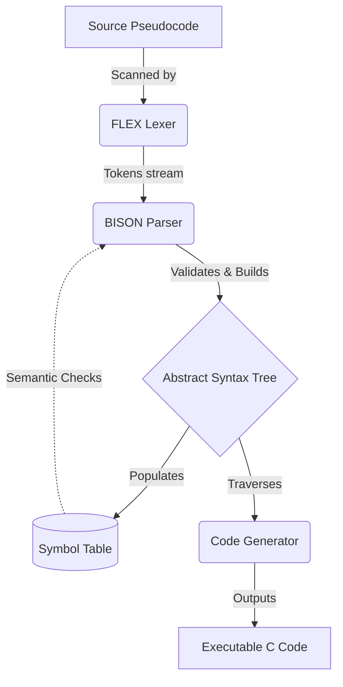

<div align="center">
  
# ⚡ Algo2C-Compiler

**A Professional Pseudocode-to-C Transpiler featuring a full MVC pipeline, FLEX/BISON backend, and a modern Web IDE.**

[](#)
[](#)
[](#)
[](#)
[](https://opensource.org/licenses/MIT)

[Features](#features) • [Architecture](#architecture) • [Installation](#installation) • [Usage](#compilation-commands) • [Screenshots](#visual-tour)

</div>

---

## 📖 Project Overview

**Algo2C-Compiler** is a full-fledged mini-compiler pipeline that translates a custom pseudocode algorithm language into executable, valid C code. 

Built from the ground up for educational compiler-design demonstrations and open-source portfolio showcasing, this project proves the end-to-end viability of traditional compiler generation tools (**FLEX** & **BISON**) dynamically hooked into a sleek, modern **Web IDE**. It seamlessly performs lexical analysis, syntax validation, semantic symbol generation, and recursive AST code-generation—all visualized in real-time.

---

## ✨ Features

- **Lexical Analysis (FLEX):** Dynamically scans algorithms and identifies structural tokens.
- **Syntax Analysis (BISON):** Parses the token stream utilizing strict, custom grammar rules.
- **Semantic Analysis:** Checks variable lifecycles and manages type-safety via a dynamically built Symbol Table.
- **Dynamic C Code Generation:** Recursively traverses the generated Abstract Syntax Tree (AST) to generate beautiful, formatted C code.
- **Modern Web IDE Frontend:** Features a CodeMirror-powered editor, real-time Token Table, Symbol Table inspector, and live Console Logs.
- **Control Flow Support:** Natively supports nested `WHILE` loops, `FOR` loops, and `IF/ELSE` branches.
- **Type Interoperability:** Automatically detects and safely generates implementations for string literals (`READSTR`) and numeric operations (`READ`).

---

## 🛠️ Tech Stack

**Frontend Web IDE**
- **HTML5 & CSS3** (TailwindCSS for rapid, premium styling)
- **Vanilla JavaScript** (ES6 Modules)
- **CodeMirror / PrismJS** (Code editing and syntax highlighting)
- **GSAP** (Smooth micro-animations)

**Backend Compiler Pipeline**
- **FLEX** (Lexical Analyzer Generator)
- **BISON** (Parser Generator)
- **C Language** (Core Compiler & AST Logic)
- **GCC** (GNU Compiler Collection)

**Server Bridge**
- **Node.js & Express** (Executes the compiled binary and serves the IDE API)

---

## 🏗️ Project Architecture

This project adopts a **Hybrid MVC + Compiler Pipeline** architecture. The frontend handles the visual IDE (*View* & *Controller*), transmitting source text to the Express bridge. The Express server spawns the C executable, feeding it the source file. 

Inside the C compiler backend, the data flows strictly as follows:



---

## 📂 Project Structure

```text
Algo2C-Compiler/
│
├── backend/                  # Core C Compiler Pipeline
│   ├── lexer/                # FLEX configurations (lexer.l)
│   ├── parser/               # BISON grammar rules (parser.y)
│   ├── models/               # Header definitions for AST and Tokens
│   ├── semantic/             # Symbol table logic & type checking
│   ├── codegen/              # AST traversal and C code generation
│   ├── controller/           # Factory methods for AST nodes
│   ├── main.c                # Compiler entry point
│   └── Makefile              # Build automation script
│
├── frontend/                 # Web IDE Interface
│   ├── css/                  # Custom UI styles and Tailwind entries
│   ├── js/                   # UI Managers and API fetchers
│   └── views/                # index.html
│
├── server.js                 # Node.js Express server & compiler bridge
├── package.json              # Backend server dependencies
└── .gitignore                # Ignored compiler artifacts
```

---

## 🚀 Installation

### 1. Prerequisites
Ensure you have the following installed on your machine:
- **Node.js** (v14 or higher)
- **GCC** (MinGW for Windows or build-essential for Linux)
- **FLEX & BISON** 
  - *Windows:* Download [win_flex_bison](https://github.com/lexxmark/winflexbison/releases) and add it to your PATH.
  - *Linux:* `sudo apt-get install flex bison`

### 2. Setup the Environment
Clone the repository and install the Express server dependencies:
```bash
git clone https://github.com/SIDRAMAPPA773/Algo2C-Compiler.git
cd Algo2C-Compiler
npm install
```

---

## ⚙️ Compilation Commands

To use the IDE, you **must build the backend C compiler first**.

### Build the Backend (Linux / Windows Git Bash)
Navigate to the `backend/` directory and compile the Flex and Bison files:
```bash
cd backend
bison -d parser/parser.y -o parser.tab.c
flex -o lex.yy.c lexer/lexer.l
gcc -o compiler lex.yy.c parser.tab.c semantic/symboltable.c codegen/codegen.c controller/compiler_controller.c main.c
cd ..
```

### Start the IDE
Fire up the backend bridge:
```bash
node server.js
```
Open your browser and navigate to `http://localhost:3000`.

---

## 💻 Sample Input / Output

**Input Pseudocode (Algorithm Editor):**
```text
START
READSTR name
READ age
IF age > 18 THEN
  PRINT "Welcome "
  PRINT name
ELSE
  PRINT "Too young"
ENDIF
END
```

**Dynamic Output (Generated C Code):**
```c
#include <stdio.h>
#include <string.h>

int main() {

    int age;
    char name[100];

    scanf("%99s", name);
    scanf("%d", &age);

    if(age > 18) {
        printf("%s\n", "Welcome ");
        printf("%s\n", name);
    }
    else {
        printf("%s\n", "Too young");
    }

    return 0;
}
```

---

## 📸 Visual Tour

### Beautiful Modern Editor & C Generation
> *(Replace with actual screenshot of your IDE showing the code generation)*
> ``

### Real-time Symbol Table & Token Tracking
> *(Replace with actual screenshot of the Token Table populating dynamically)*
> ``

### Semantic Error Handling
> *(Replace with actual screenshot showing semantic errors catching undeclared variables)*
> ``

---

## 🔮 Future Enhancements

- [ ] **AST Visualization:** Render a graphical node tree of the parsed algorithm in the UI.
- [ ] **Function Support:** Add grammar to support distinct function declarations and returns.
- [ ] **Array Logic:** Implement 1D and 2D arrays within the pseudocode rules.
- [ ] **WebAssembly (WASM):** Compile the C backend directly to WASM to run the compiler entirely in the browser without a Node server.
- [ ] **Optimization Phase:** Add an intermediate optimization layer (e.g., dead code elimination) before C generation.

---

## 🤝 Contribution Guidelines

Contributions, issues, and feature requests are welcome! Feel free to check the [issues page](#). 

1. Fork the Project
2. Create your Feature Branch (`git checkout -b feature/AmazingFeature`)
3. Commit your Changes (`git commit -m 'Add some AmazingFeature'`)
4. Push to the Branch (`git push origin feature/AmazingFeature`)
5. Open a Pull Request.

---

## 📜 License

Distributed under the MIT License. See `LICENSE` for more information.

---
<div align="center">
  <i>Built with passion by <a href="https://github.com/SIDRAMAPPA773">Sidramappa</a> for mastering Advanced Compiler Engineering.</i>
</div>
